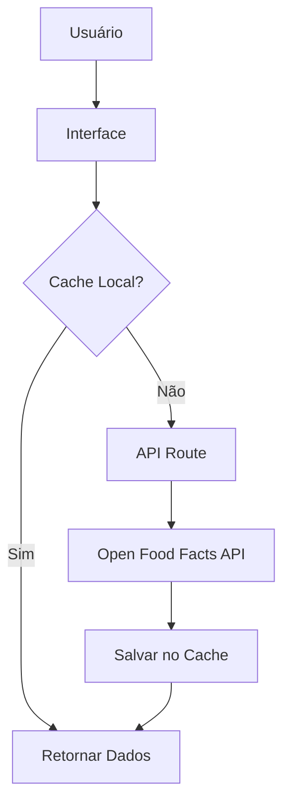

# NutriScan

<div align="center">


**Plataforma completa de informações nutricionais alimentares**

_Descubra o que a comunidade alimentar sabe sobre seus alimentos_

[](https://nextjs.org/)
[](https://www.typescriptlang.org/)
[](https://www.prisma.io/)
[](https://tailwindcss.com/)
[](https://world.openfoodfacts.org/)

[](https://nutriscan.evandro.dev.br)
[](https://github.com/evandrodevbr/lista-compras/issues)
[](https://github.com/evandrodevbr/lista-compras/issues)

</div>

## 📋 Índice

- [Sobre o Projeto](#-sobre-o-projeto)
- [Demonstração Visual](#-demonstração-visual)
- [Funcionalidades](#-funcionalidades)
- [Stack Tecnológica](#-stack-tecnológica)
- [Arquitetura](#-arquitetura)
- [Instalação e Setup](#-instalação-e-setup)
- [API e Integrações](#-api-e-integrações)
- [Database Schema](#-database-schema)
- [Performance e Otimizações](#-performance-e-otimizações)
- [Deployment](#-deployment)
- [Scripts Disponíveis](#-scripts-disponíveis)
- [Contribuindo](#-contribuindo)
- [Licença](#-licença)
- [Contato](#-contato)
- [Agradecimentos](#-agradecimentos)

## 🚀 Sobre o Projeto

**NutriScan** é uma plataforma web moderna que democratiza o acesso a informações nutricionais transparentes e confiáveis. Desenvolvida com foco na experiência do usuário e performance, a aplicação conecta consumidores conscientes à maior base de dados colaborativa de alimentos do mundo.

### 🎯 Missão

Empoderar usuários com dados nutricionais precisos e abrangentes para tomada de decisões alimentares mais conscientes através de uma plataforma intuitiva, rápida e confiável.

### ⭐ Diferenciais

- **Dados Colaborativos**: Acesso a milhões de produtos da maior base de dados open source do mundo
- **Filtros Avançados**: Sistema sofisticado de busca e filtros para descoberta precisa de produtos
- **Classificações de Saúde**: Nutri-Score e NOVA group para avaliação rápida da qualidade
- **Atualizações em Tempo Real**: Sincronização de dados ao vivo e resultados instantâneos
- **Arquitetura Moderna**: Desenvolvida com tecnologias de ponta e foco em performance

### 📊 Estatísticas

| Métrica             | Valor |
| ------------------- | ----- |
| Produtos no banco   | 2M+   |
| Países cobertos     | 100+  |
| Disponibilidade     | 24/7  |
| Dados colaborativos | Sim   |

## 📱 Demonstração Visual

> **Nota**: Screenshots serão adicionados em breve mostrando as principais funcionalidades da aplicação.

### Principais Telas

- **Página Inicial**: Interface de busca com hero section e barra de pesquisa
- **Resultados**: Lista de produtos com filtros avançados e ordenação
- **Detalhes do Produto**: Informações nutricionais completas e classificações
- **Lista de Compras**: Gerenciamento de produtos com quantidades e status
- **Modos de Tema**: Visualização em tema claro e escuro

## ✨ Funcionalidades

### 🔍 Sistema de Busca Inteligente

O NutriScan oferece múltiplas formas de encontrar produtos alimentícios:

- **Busca por Código de Barras**: Reconhecimento automático de códigos de 8-13 dígitos
- **Busca por Nome/Marca**: Pesquisa textual inteligente com sugestões
- **Detecção Automática**: Sistema que identifica o tipo de busca automaticamente
- **Geolocalização**: Priorização de produtos locais baseada na localização do usuário
- **API Proxy**: Chamadas seguras através de rotas Next.js para evitar problemas de CORS

### 💾 Sistema de Cache Avançado

Sistema multi-camada de cache para performance otimizada:

- **Cache localStorage**: Armazenamento local com TTL configurável
- **Cache de Buscas**: Armazenamento completo de buscas com filtros aplicados
- **Cache JSON**: 218 produtos pré-carregados para uso offline
- **Modo Cache-Only**: Funcionamento completo sem conexão com internet
- **Sincronização Inteligente**: Atualização automática de dados quando online
- **Estatísticas de Storage**: Monitoramento de uso de armazenamento

### 🎛️ Filtros e Ordenação

Sistema robusto de filtros para descoberta precisa:

#### Classificações de Saúde

- **Nutri-Score**: Filtro por classificação A-E (muito bom a muito ruim)
- **NOVA Group**: Filtro por nível de processamento 1-4 (não processado a ultraprocessado)

#### Filtros de Produto

- **Categorias**: Filtro por tipo de alimento (bebidas, laticínios, snacks, etc.)
- **Marcas**: Filtro por fabricante
- **Alérgenos**: Identificação e filtro por substâncias alergênicas
- **Aditivos**: Filtro por aditivos alimentares e conservantes

#### Filtros Nutricionais

- **Ranges Personalizados**: Filtros por valores nutricionais (calorias, gorduras, açúcares, etc.)
- **12 Opções de Ordenação**: Por relevância, nutrição, nome, marca, valores nutricionais, etc.

### 🛒 Listas de Compras Colaborativas

Sistema completo de gerenciamento de compras:

- **Múltiplas Listas**: Criação e gerenciamento de várias listas de compras
- **Produtos Detalhados**: Adição com quantidade, unidade e observações
- **Status de Compra**: Marcação de itens como comprados
- **Sincronização**: Persistência via Prisma + SQLite
- **Compartilhamento**: Compartilhamento de listas via ID único

### 🎨 Interface e Experiência do Usuário

Design moderno e acessível:

- **Design Responsivo**: Mobile-first com adaptação para todos os dispositivos
- **Temas**: Modo claro e escuro com persistência de preferência
- **Animações**: Transições suaves com Framer Motion
- **Acessibilidade**: Componentes Radix UI com suporte completo a leitores de tela
- **Estados de Loading**: Skeletons e indicadores de carregamento
- **Paginação Otimizada**: Carregamento eficiente de grandes listas
- **Imagens Otimizadas**: Lazy loading e otimização automática

## 🛠 Stack Tecnológica

### Framework Principal

- **[Next.js 14.2.18](https://nextjs.org/)** - React framework com App Router e Server Actions
- **[TypeScript 5.7.2](https://www.typescriptlang.org/)** - JavaScript tipado para maior confiabilidade
- **[React 18.3.1](https://react.dev/)** - Biblioteca de interface moderna com recursos concorrentes

### Banco de Dados e ORM

- **[Prisma 5.22.0](https://www.prisma.io/)** - ORM type-safe para gerenciamento de dados
- **[SQLite](https://www.sqlite.org/)** - Banco de dados leve e serverless

### Estilização e UI

- **[Tailwind CSS 3.4.15](https://tailwindcss.com/)** - Framework CSS utility-first
- **[shadcn/ui](https://ui.shadcn.com/)** - Biblioteca de componentes reutilizáveis
- **[Radix UI](https://www.radix-ui.com/)** - Primitivos acessíveis não estilizados
- **[Lucide Icons 0.460.0](https://lucide.dev/)** - Ícones bonitos e customizáveis
- **[Framer Motion 11.12.0](https://www.framer.com/motion/)** - Biblioteca de animações

### APIs Externas

- **[Open Food Facts](https://world.openfoodfacts.org/)** - Base de dados global de produtos alimentícios
- **Geolocation API** - Recomendações baseadas em localização

### Ferramentas de Desenvolvimento

- **[ESLint 8.57.1](https://eslint.org/)** - Linting e formatação de código
- **[PostCSS 8.4.49](https://postcss.org/)** - Processamento de CSS
- **[pnpm](https://pnpm.io/)** - Gerenciador de pacotes eficiente

## 🏗 Arquitetura

### Estrutura do App Router

```
app/
├── actions.ts                    # Server Actions para mutações de dados
├── api/                         # Rotas de API para proxies de serviços externos
│   ├── cache/sync/              # Sincronização de cache
│   ├── location/                # Serviços de geolocalização
│   ├── products/[barcode]/      # Proxy de busca de produto
│   ├── search/                  # Proxy de busca Open Food Facts
│   └── storage-stats/           # Estatísticas de armazenamento
├── components/                  # Componentes específicos de funcionalidades
│   ├── landing/                 # Seções da página inicial
│   └── [componentes diversos]   # Componentes reutilizáveis
├── lista/[id]/                  # Páginas de lista de compras
├── produto/[barcode]/           # Páginas de detalhes do produto
├── resultados/                  # Página de resultados de busca
└── layout.tsx                   # Layout raiz
```

### Fluxo de Dados

1. **Requisições de Busca**: Entrada do usuário → Rota de API → API Open Food Facts → Resposta
2. **Gerenciamento de Listas**: Ações do usuário → Server Actions → Prisma → Banco de dados
3. **Atualizações em Tempo Real**: Server Actions → Banco de dados → Revalidação → Atualização da UI

### Sistema de Cache



## 🚦 Instalação e Setup

### Pré-requisitos

- **Node.js** 18.0 ou superior
- **pnpm** 8.0 ou superior (gerenciador de pacotes recomendado)

### Instalação Passo a Passo

1. **Clone o repositório**

   ```bash
   git clone https://github.com/evandrodevbr/lista-compras.git
   cd lista-compras
   ```

2. **Instale as dependências**

   ```bash
   pnpm install
   ```

3. **Configure as variáveis de ambiente**

   ```bash
   cp .env.example .env.local
   ```

   Configure as seguintes variáveis:

   ```env
   DATABASE_URL="file:./prisma/db/database.sqlite"
   NEXT_PUBLIC_SITE_URL="http://localhost:3000"
   ```

4. **Inicialize o banco de dados**

   ```bash
   pnpm db:generate
   pnpm db:migrate
   ```

5. **Inicie o servidor de desenvolvimento**

   ```bash
   pnpm dev
   ```

6. **Abra seu navegador**
   Navegue para [http://localhost:3000](http://localhost:3000)

### Troubleshooting

**Problema**: Erro de conexão com banco de dados

- **Solução**: Verifique se o arquivo `database.sqlite` existe em `prisma/db/`

**Problema**: Erro de build do Prisma

- **Solução**: Execute `pnpm db:generate` antes do build

**Problema**: Dependências não instaladas

- **Solução**: Use `pnpm install --no-frozen-lockfile`

## 🔌 API e Integrações

### Integração Open Food Facts

O NutriScan integra com a API Open Food Facts através de um wrapper customizado (`lib/openFoodFactsApi.ts`) que fornece:

- **Busca de Produtos**: Pesquisa por nome, marca ou categoria
- **Lookup por Código de Barras**: Busca direta usando códigos de barras
- **Filtros Avançados**: Filtros por notas nutricionais, alérgenos, aditivos e mais
- **Cache**: Estratégia de cache inteligente para melhor performance
- **Tratamento de Erros**: Tratamento abrangente de erros e mecanismos de fallback

### Endpoints Disponíveis

| Endpoint                  | Descrição                     | Método |
| ------------------------- | ----------------------------- | ------ |
| `/api/search`             | Busca de produtos             | GET    |
| `/api/products/[barcode]` | Busca de produto específico   | GET    |
| `/api/location`           | Serviços de geolocalização    | GET    |
| `/api/cache/sync`         | Sincronização de cache        | POST   |
| `/api/storage-stats`      | Estatísticas de armazenamento | GET    |

### Rate Limits e Cache

- **Resultados de Busca**: Cache de 1 hora para reduzir chamadas à API
- **Detalhes de Produto**: Cache de 24 horas para produtos frequentemente acessados
- **Opções de Filtro**: Cache de 1 semana para dados estáticos como categorias e marcas

## 🗄 Database Schema

### Schema Prisma

```prisma
model Lista {
  id        String     @id
  createdAt DateTime   @default(now())
  updatedAt DateTime   @default(now()) @updatedAt
  produtos  Produtos[]
}

model Produtos {
  id        Int      @id @default(autoincrement())
  nome      String
  qtd       Float
  tipoUN    String
  comprado  Boolean  @default(false)
  listaId   String   @default("default")
  createdAt DateTime @default(now())
  updatedAt DateTime @default(now()) @updatedAt
  lista     Lista    @relation(fields: [listaId], references: [id])
}
```

### Características Principais

- **Estrutura Simples**: Fácil de entender e manter
- **Listas Flexíveis**: Suporte para múltiplas listas de compras
- **Rastreamento de Produtos**: Gerenciamento de quantidade e unidade
- **Rastreamento de Status**: Status de compra para cada item
- **Timestamps**: Rastreamento automático de criação e atualização

## ⚡ Performance e Otimizações

### Estratégia de Cache Multi-Camada

1. **Cache de Busca**: Armazenamento local de resultados de busca
2. **Cache de Produtos**: Cache JSON de produtos populares
3. **Cache de Imagens**: Lazy loading e otimização automática
4. **Cache de API**: Cache de respostas da API Open Food Facts

### Otimizações de Performance

- **Lazy Loading**: Carregamento sob demanda de imagens e componentes
- **Code Splitting**: Divisão automática de código por rota
- **Otimização de Bundle**: Minificação e tree-shaking automáticos
- **Server Actions**: Atualizações de dados sem recarregamento de página
- **Image Optimization**: Otimização automática de imagens com Next.js

### Métricas de Performance

- **First Load JS**: ~87.3 kB compartilhado
- **Build Time**: Otimizado com Prisma e Next.js
- **Cache Hit Rate**: Monitorado via storage stats API

## 🚀 Deployment

### Configuração Dokploy

O projeto inclui configuração para deployment via Dokploy (`dokploy.yaml`):

```yaml
build:
  pre_build:
    - npm install -g pnpm@latest
    - export PNPM_HOME="/root/.local/share/pnpm"
    - export PATH="$PNPM_HOME:$PATH"
  steps:
    - name: Verify pnpm
      run: which pnpm && pnpm --version
    - name: Install dependencies
      run: pnpm install --no-frozen-lockfile
    - name: Generate Prisma Client
      run: pnpx prisma generate
    - name: Build application
      run: pnpm run build
```

### Configuração Nixpacks

Configuração alternativa para deployment (`nixpacks.toml`):

```toml
[phases.setup]
nixPkgs = ['nodejs_18', 'openssl']
cmds = [
  'npm install -g pnpm@latest',
  'npm install -g prisma'
]

[phases.install]
cmds = [
  'npx pnpm install --no-frozen-lockfile',
  'mkdir -p prisma',
  'touch prisma/dev.db',
  'chmod -R 777 prisma'
]

[phases.build]
cmds = [
  'mkdir -p node_modules/.prisma',
  'mkdir -p .next',
  'chmod -R 777 node_modules/.prisma node_modules/.bin .next prisma',
  'npx prisma generate',
  'npx prisma db push --accept-data-loss',
  'npx pnpm run build'
]

[start]
cmd = 'npx pnpm start'
```

### Checklist de Deployment

- [ ] Configurar variáveis de ambiente
- [ ] Executar migrações do banco de dados
- [ ] Gerar Prisma Client
- [ ] Build da aplicação
- [ ] Configurar domínio e SSL
- [ ] Testar funcionalidades principais

## 📜 Scripts Disponíveis

### Desenvolvimento

```bash
pnpm dev              # Inicia servidor de desenvolvimento (http://localhost:3000)
pnpm build            # Build para produção
pnpm start            # Inicia servidor de produção
pnpm lint             # Executa ESLint
```

### Banco de Dados

```bash
pnpm db:push          # Push do schema Prisma para o banco
pnpm db:generate      # Gera Prisma Client
pnpm db:migrate       # Executa migrações do banco
```

### Pós-instalação

```bash
pnpm postinstall      # Gera Prisma Client após instalação
```

## 🤝 Contribuindo

Agradecemos contribuições da comunidade! Aqui está como você pode ajudar:

### Para Desenvolvedores

1. **Fork o repositório**
2. **Crie uma branch de feature**
   ```bash
   git checkout -b feature/amazing-feature
   ```
3. **Faça suas alterações**
4. **Commit suas alterações**
   ```bash
   git commit -m 'Add: amazing feature'
   ```
5. **Push para a branch**
   ```bash
   git push origin feature/amazing-feature
   ```
6. **Abra um Pull Request**

### Para Usuários Finais

- **Reportar Bugs**: Use [GitHub Issues](https://github.com/evandrodevbr/lista-compras/issues)
- **Solicitar Features**: Sugira novas funcionalidades via [GitHub Issues](https://github.com/evandrodevbr/lista-compras/issues)
- **Fornecer Feedback**: Compartilhe sua experiência e sugestões

### Guidelines de Desenvolvimento

- Siga o estilo de código existente
- Escreva mensagens de commit claras
- Adicione testes para novas funcionalidades
- Atualize documentação quando necessário
- Certifique-se de que todos os checks passem antes de submeter PR

## 📄 Licença

Este projeto está licenciado sob uma **Licença de Uso Pessoal**.

### Permissões

- ✅ Uso pessoal em localhost
- ✅ Inspeção de código e aprendizado
- ✅ Desenvolvimento e teste local

### Restrições

- ❌ Deploy público na web
- ❌ Uso comercial
- ❌ Redistribuição para terceiros
- ❌ Criação de obras derivadas para distribuição pública

Para os termos completos da licença, consulte o arquivo [LICENSE](LICENSE).

## 📫 Contato

**Autor:** Evandro  
**Website:** [evandro.dev.br](https://evandro.dev.br)  
**GitHub:** [@evandrodevbr](https://github.com/evandrodevbr)  
**Email:** evandro@evandro.dev.br

### Links do Projeto

- **Live Demo:** [nutriscan.evandro.dev.br](https://nutriscan.evandro.dev.br)
- **Repositório:** [github.com/evandrodevbr/lista-compras](https://github.com/evandrodevbr/lista-compras)
- **Issues:** [GitHub Issues](https://github.com/evandrodevbr/lista-compras/issues)

## 🙏 Agradecimentos

- **[Open Food Facts](https://world.openfoodfacts.org/)** - Pela base de dados abrangente de alimentos
- **[shadcn/ui](https://ui.shadcn.com/)** - Pela biblioteca de componentes acessíveis
- **[Next.js Team](https://nextjs.org/)** - Pelo framework React incrível
- **[Vercel](https://vercel.com/)** - Por soluções de hosting e deployment
- **[Prisma](https://www.prisma.io/)** - Pelo excelente ORM
- **Contribuidores** - Obrigado a todos que ajudam a melhorar este projeto

---

<div align="center">
  <p>Desenvolvido com ❤️ por <a href="https://evandro.dev.br">evandro.dev.br</a></p>
  <p>Feito para usuários conscientes com a saúde e desenvolvedores ao redor do mundo</p>
</div>
